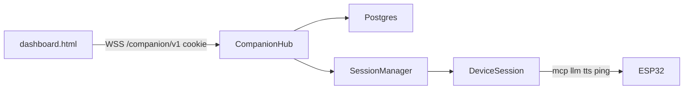

# Companion dashboard — remaining phases

**Status:** planning document only. Phase 1 is already shipped. This file is the source of truth for **Phase 2 onward**.  
**Date:** 2026-08-30  
**Site:** https://phoelone.thukha.online/  
**Related:** [PRODUCTION_MASTER_PLAN.md](PRODUCTION_MASTER_PLAN.md) (P2.1, P2.2, P2.5), [backend_spec.md](backend_spec.md) §2.4 and §12, [BACKEND_PRODUCTION_PLAN.md](BACKEND_PRODUCTION_PLAN.md).

Do not implement from this file until a phase is explicitly scheduled. Do not skip Phase 1 invariants.

---

## 0. How to read this

| Section | Purpose |
|---------|---------|
| [1. Phase 1 baseline](#1-phase-1-baseline-already-shipped) | What the dashboard already does |
| [2. Invariants](#2-invariants) | Rules later phases must not break |
| [3. Phase 2 — Phone chat](#3-phase-2--phone-chat) | Text on the site → Mickey speaks |
| [4. Phase 3 — Memory, care, achievements](#4-phase-3--memory-care-achievements) | Postgres personality + light Tamagotchi |
| [5. Phase 4 — Alarm and settings](#5-phase-4--alarm-and-settings) | UI over existing MCP; user-only tools |
| [6. Phase 5 — More games](#6-phase-5--more-games) | Tic-tac-toe, Simon, trivia |
| [7. Phase 6 — Always-on + LCD icons](#7-phase-6--always-on--lcd-icons) | Firmware keepalive; optional `preview_image` |
| [8. Later / gated](#8-later--gated) | Sensors widgets, OTA UI, camera |
| [9. Suggested order](#9-suggested-build-order) | Smallest verticals |

---

## 1. Phase 1 baseline (already shipped)

The portal is no longer activation-only.

| Piece | Where |
|-------|--------|
| Cookie auth + PIN unlock | [`app/companion/auth.py`](app/companion/auth.py), [`app/api/portal.py`](app/api/portal.py), [`app/api/companion.py`](app/api/companion.py) |
| Browser hub | [`app/companion/hub.py`](app/companion/hub.py) on `app.state.companion` |
| Device API | `DeviceSession.companion_action` / `presence_snapshot` / `refresh_status` in [`app/sessions/session.py`](app/sessions/session.py) |
| RPS + dance | [`app/companion/games/rps.py`](app/companion/games/rps.py), [`app/companion/reactions.py`](app/companion/reactions.py) |
| UI | [`app/templates/dashboard.html`](app/templates/dashboard.html) |
| Wire protocol | [backend_spec.md](backend_spec.md) §12 |

**What the user can do today:** activate → dashboard → presence / dance pad / Stop / RPS. Mickey must already have `/xiaozhi/v1/` open (“Wake Mickey first”).

**What is not built:** phone chat, care meters, owner memory, achievements, alarm UI, extra games, firmware idle keepalive, LCD icon push.

---

## 2. Invariants

These stay true for every later phase.

1. **No second ESP32 protocol.** Browser frames stay on `/companion/v1/`. The robot keeps `mcp` / `llm` / `tts` / `ping` / `alert` on `/xiaozhi/v1/`. Do not add `type: iot` or MQTT.
2. **Browser never sees the NVS WebSocket bearer.** Cookie + optional `COMPANION_PIN` only.
3. **Gemini is not a game referee.** Deterministic engines (RPS, tic-tac-toe, Simon) stay in Python. Gemini is for chat, trivia flavor, and voice.
4. **User-only MCP stays hidden from the LLM.** [`USER_ONLY_TOOLS`](app/mcp/catalog.py) (`reboot`, `upgrade_firmware`, `screen.snapshot`, `screen.preview_image`, …) are companion Settings only. List tools with `withUserTools: false` for Gemini (master plan P2.5).
5. **4-servo, no camera, no hands.** GPIO 12 is LCD CS. Dance/game motions stay in the Phase 1 allowlist plus existing loco actions (`turn` is fine if added carefully).
6. **Idle life is on-device.** A cloud socket must not be required for fidget / pet / fall. Cloud is an enhancement. Phase 6 keepalive is optional presence, not the heartbeat of the body ([PRODUCTION_MASTER_PLAN.md](PRODUCTION_MASTER_PLAN.md) §1.3).
7. **Single uvicorn worker.** In-memory `CompanionHub` + `SessionManager` is correct. Do not add Redis pub/sub or a second worker for companion fan-out ([README.md](README.md)).
8. **Conflict policy** stays: THINKING refuses dance/games/chat-start; SPEAKING allows dance, refuses new RPS/chat until Stop; Stop always `self.otto.stop` + abort; fall inhibit skips motion but may still update web state.
9. **1 vCPU / 2 GB.** No Celery. Prefer an `asyncio` loop started in the existing FastAPI **lifespan** (the current replacement for deprecated `@app.on_event("startup")`). Add APScheduler only if cron expressions become painful; if so, use `AsyncIOScheduler` in lifespan and shut it down on exit. Persist schedules in Postgres, not only RAM.



---

## 3. Phase 2 — Phone chat

**Goal:** type on the phone; Mickey answers in Burmese on the speaker with a face. Highest EMO-app feel after RPS.

### Why this shape

Voice turns already go Gemini Live → Edge TTS → Opus. Chat must reuse that path, not open a second Live session. [`GeminiLiveBrain.notify_music_finished`](app/ai/gemini.py) already injects a text turn with `send_client_content(..., turn_complete=True)`. Phone chat is the same idea with a user-visible prompt instead of an INTERNAL EVENT.

### Browser protocol (add)

```text
chat.send     { text }                    # browser → server
chat.user     { text }                    # echo / transcript
chat.reply    { text, emotion }           # after TTS starts or completes
```

Cap `text` (e.g. 400 chars). Empty / whitespace → `error.invalid`.

### Server flow

1. Hub checks session online; else `offline` + wake banner.
2. If THINKING or SPEAKING → `busy` (“Tap Stop first”).
3. Broadcast `chat.user` immediately (optimistic UI).
4. `DeviceSession.companion_action("chat", {"text": ...})`:
   - Mark a **companion turn** so Gemini Otto-gate still requires clear intent (do not treat the typed line as mic noise).
   - Inject into the **existing** Live socket via `send_client_content` (same family as music INTERNAL EVENT). Do not call `begin_utterance` / uplink PCM.
   - Reuse `_handle_tools` + `_speak` / `_consume_speakable` so weather, music, and `set_emotion` still work.
   - After speech, `companion` lock releases; broadcast `chat.reply` + `presence`.
5. Dashboard **Stop** remains `command.stop` (abort + `self.otto.stop`).

### Busy / spend

- One in-flight chat per device (the existing `_companion_lock`).
- Count toward P2.10 later (Gemini/TTS caps). For Phase 2, reuse `companion_rate_limit_per_minute` and a tighter `chat` sub-limit (e.g. 10/min).
- Do not persist full transcripts in Postgres yet (that is Phase 3 optional journal). In-RAM last N lines on the hub is enough for the open page.

### UI

New **Chat** section on [`dashboard.html`](app/templates/dashboard.html): text field, send, last 10 bubbles, disabled when offline/busy. Keep Jinja + vanilla JS.

### Files (when implementing)

- [`app/companion/hub.py`](app/companion/hub.py) — `chat.send`
- [`app/sessions/session.py`](app/sessions/session.py) — `companion_action("chat")`
- [`app/ai/gemini.py`](app/ai/gemini.py) — `send_text_turn(user_text)` next to `notify_music_finished`
- [`app/ai/prompts.py`](app/ai/prompts.py) — one line: typed companion chat is real user speech (not INTERNAL EVENT)
- Tests: contract WS with FakeBrain; unit for empty/cap/`busy`

### Acceptance

- Offline → no Gemini call.
- Online + “မင်္ဂလာပါ” → device gets `tts/start` and a Burmese sentence; dashboard shows `chat.reply`.
- Stop cuts mid-reply (generation bump).
- Existing voice wake still works after a typed turn.

---

## 4. Phase 3 — Memory, care, achievements

**Goal:** Mickey remembers the owner, and the Home screen has light Tamagotchi meters + badges. Maps to master-plan **P2.2**.

### 4.1 Owner memory (do this first)

Postgres is device/token-only today ([`devices`](app/db/sqlalchemy_repo.py)). Chat context dies with the process ([README.md](README.md)).

New table `owner_memory` (Alembic `0004_companion_memory`, revises `0003_token_ciphertext`):

| Column | Notes |
|--------|--------|
| `device_id`, `client_id` | FK-style unique pair |
| `owner_name` | spoken name |
| `nickname` | what they call Mickey |
| `likes` | short free text |
| `locale` | default `my-MM` |
| `updated_at` | |

Inject into Gemini `system_instruction` (or a prefix turn) when the Live session configures — **not** by changing the global [`SYSTEM_PROMPT`](app/ai/prompts.py) string at import time. Load per device in `DeviceSession._discover_mcp` / `brain.configure`.

Dashboard: small **Mickey knows me** form. Protocol:

```text
memory.get     {}
memory.set     { owner_name?, nickname?, likes? }
memory.state   { owner_name, nickname, likes }
```

Or REST `GET/PUT /companion/memory` with the same cookie (simpler for a form POST). Either is fine; pick one and document in `backend_spec.md` §12.

### 4.2 Care meters (light, not a second game)

Table `care_state`:

| Meter | Up | Down |
|-------|----|------|
| Happiness | chat, games, web pet, real touch (when wired) | neglect (hours) |
| Energy | sleep / night / `self.mickey.sleep.now` | dances, walks |
| Bond | daily streak (voice or web) | long offline |

Decay: one **lifespan** `asyncio` task, tick every 5–10 minutes, update rows, `CompanionHub.broadcast` `care.state` if viewers exist. No Celery. Tick must be cheap (one SQL statement per active device).

```text
care.action    { kind: "pet" | "feed" }    # feed is flavor only
care.state     { happiness, energy, bond, streak_days, updated_at }
```

When firmware emits `notifications/phoe_lone.event` (`pet` / `pickup`) and the backend already handles it, credit the same meters. Do not require sensors to ship care — web pet is enough.

**Do not** invent nutrition science or let Gemini invent sensor numbers.

### 4.3 Achievements

Table `achievements` (`device_id`, `code`, `unlocked_at`). Event log, not a MMO.

Starter codes: `first_activate`, `first_web_dance`, `first_rps_win`, `chat_streak_3`, `first_pet` (sensor-gated).

Broadcast `achieve.unlock` once; Home shows a short badge row.

### UI

Home: three meters + badges. Settings or Home footer: memory editor.

### Acceptance

- Restart uvicorn → name still in the next voice/chat prompt.
- Pet on the web raises happiness; meter visible on a second tab via hub broadcast.
- Memory-db test backend (`database_url=memory://`) needs an in-memory stand-in so CI does not require Postgres.

---

## 5. Phase 4 — Alarm and settings

**Goal:** dashboard UI for clocks and lab controls that already exist on the device. Maps to **P2.1** (greeting/sleep) + leftover **P2.5** (user-only MCP).

### 5.1 Alarm (device clock is source of truth)

MCP already exists and is LLM-visible:

- `self.mickey.alarm.set` / `.get` / `.cancel`
- `self.mickey.sleep.now`

Firmware owns the wake clock so bedtime works **with WebSocket closed**. The dashboard is a friendly form, not a second scheduler.

```text
alarm.get      {}
alarm.set      { hour, minute, repeat?, sleep_now? }
alarm.cancel   {}
alarm.state    { hour, minute, repeat, set: bool }
sleep.now      {}
```

Hub → `companion_action` → existing `mcp.call`. If offline, `error.offline` (“Wake Mickey to change the alarm”) — do not pretend a server cron replaced the robot clock.

**Server-side “remind me at 7”** (spoken line if WS happens to be open) is optional and later. If added, persist in Postgres and tick from the same lifespan loop as care decay. FastAPI `BackgroundTasks` are for fire-and-forget after a request, not cron. Prefer `asyncio.create_task` in lifespan; add `AsyncIOScheduler` only if many user crons appear. Still a single worker — no Celery.

Morning greeting: prompt + local clock on firmware (BACKEND_PRODUCTION_PLAN P2.1). Do not spam `tts` from the cloud every sunrise unless the device is connected and the user opted in.

### 5.2 Settings (user-only MCP)

Companion-only, never Gemini:

| Control | Tool |
|---------|------|
| Volume / brightness / theme | existing LLM tools (safe from the dashboard too) |
| Press-to-talk | `self.set_press_to_talk` |
| Servo trims | `self.otto.get_trims` / `set_trim` |
| Reboot | `self.reboot` |
| OTA trigger | `self.upgrade_firmware` — **confirm UI**, no `force` from the page |

`withUserTools` must stay **true only** on this companion path (new `McpClient.list_tools` flag or a one-shot `tools/list` with `withUserTools: true` from `companion_action`, never from `gemini_tools`).

LCD snapshot/preview: Phase 6, not required here.

### UI

**Alarm** card: time picker, daily toggle, Sleep now, Cancel.  
**Settings** card: sliders + dangerous actions behind confirm.

### Acceptance

- `alarm.get` after `alarm.set` matches the form.
- Gemini still cannot see `self.reboot` in `gemini_tools`.
- Offline set → `offline`, no silent server-only alarm.

---

## 6. Phase 5 — More games

Same hub + `companion_action("rps_react")` pattern as Phase 1. New engines under `app/companion/games/`. LCD stays a face unless Phase 6 icons exist.

### 6.1 Tic-tac-toe

- Board only on the web.
- **Minimax on the server** (easy/medium). Do not spend Gemini tokens per move.
- Reaction vocabulary: `thinking` + `swing` while “deciding”; win/draw/lose same as RPS (`jump` / `home` / `sit`).
- Protocol: `game.start { game: "ttt" }`, `game.move { game: "ttt", cell: 0-8 }`, `game.state` with `board`, `turn`, `winner`.

### 6.2 Simon / memory

- Four “colors” mapped to body: left `bend`, right `bend`, `jump`, `sit`.
- Server stores the sequence; web flashes **and** Mickey performs each step (await motion MCP, then next). User repeats on the web.
- RTT is 200–800 ms — pause ~400 ms between steps. Not a twitch game.

### 6.3 Trivia

- First ship a **static Burmese/English pack** (JSON). Gemini-generated questions are a later toggle with a spend cap.
- `game.move { game: "trivia", choice: 0-3 }`.
- Same win/lose theater as RPS.

### 6.4 Optional later games

Number guess, high-low, red-light/green-light (`walk` / `stop`). Rhythm tap waits on music-path work (Speaking occupies TTS).

### Shared rules

- `game: "rps" | "ttt" | "simon" | "trivia"` on the same `game.*` frames.
- One active match per device in `CompanionHub._matches`.
- Hand actions stay rejected.
- Tests: pure engine unit tests (win/draw/illegal move) plus one contract move per game.

---

## 7. Phase 6 — Always-on + LCD icons

**Goal:** open the site and play without a wake word; optional big R/P/S icon on the 240×240.

### 7.1 Firmware companion keepalive (phoelone repo)

Today the device opens `/xiaozhi/v1/` for a voice session and the server may idle-close after ~100 s of no **inbound** frames. Phase 1 already **skips that close while a dashboard viewer exists**, and keeps JSON `ping`. That does **not** help if the robot never connected.

Firmware work (CLIENT / master plan P2 “lightweight heartbeat WS”):

- Stay connected in idle (or reconnect) without being in a voice turn.
- Answer `ping` with `pong` (P0.6 — if not already flashed).
- Idle director still runs **locally** and is preempted by MCP, wake, pet, fall.
- Do not call the cloud to decide a fidget.

Backend: Home banner becomes “Mickey is sleeping” vs “offline” only when you have a real sleep state (`self.mickey.sleep.now` / firmware). Until then, keep the honest wake copy when `SessionManager.get` is empty.

### 7.2 LCD icons (`preview_image`)

User-only `self.screen.preview_image` GETs an image URL onto the LCD ([backend_spec.md](backend_spec.md) §5.6). Needs `CONFIG_LV_USE_SNAPSHOT` / preview on firmware.

Backend: host tiny 240×240 assets (`/static/companion/rps-rock.png`, …) on the same origin. Companion reaction plan may call preview **after** `llm` emotion, before or after motion. Fail soft if the tool is missing.

Do not use snapshot as a live video tile. Optional rare snapshot for a “what is the face” thumbnail is P2-gated and heavy on the ESP32.

---

## 8. Later / gated

Not companion-dashboard blockers.

| Item | Gate |
|------|------|
| Sensor graphs (IMU, light, touch, pet count) | P0.S `wired: true` + stop dropping notifications (already sketched in the master plan) |
| Music jukebox on Home | Existing [`search_music`](app/tools/music.py) / local catalog; do not start TTS games during a track |
| Signed OTA channel `phoe-lone` | P2.3 — Settings can show version only until then |
| Glyph-push of scores on LCD | P2.7 `features.glyph_push` |
| Camera / face games | P2.8 hardware — this SKU is no-camera |
| Gemini/TTS spend caps | P2.10 |
| LivingAI APIs, MQTT voice, 4G | Out of scope |

---

## 9. Suggested build order

| Slice | Ship | Depends on |
|-------|------|------------|
| **2** | Phone chat | Phase 1 hub + Live `send_client_content` |
| **3a** | Owner memory + Alembic | Postgres in prod; memory stub in tests |
| **3b** | Care meters + achievements | 3a table style; lifespan tick |
| **4** | Alarm + Settings UI | Device MCP; user-only list flag |
| **5** | TTT → Simon → trivia | Phase 1 game pipe |
| **6a** | Firmware keepalive | phoelone P0 ping/pong |
| **6b** | LCD `preview_image` | firmware preview + static assets |

Stop after each slice and add contract tests the way Phase 1 did (`tests/contract/test_companion.py`).

---

## 10. Protocol additions (summary)

Keep ignoring unknown `type`s. Extend §12 of `backend_spec.md` when a phase lands — not before.

| Phase | New browser `type`s |
|-------|---------------------|
| 2 | `chat.send`, `chat.user`, `chat.reply` |
| 3 | `memory.*`, `care.*`, `achieve.unlock` |
| 4 | `alarm.*`, `sleep.now`, `settings.*` (or HTTP forms) |
| 5 | `game.start` / `game.move` with new `game` enums |
| 6 | none required (firmware + optional preview MCP) |

---

## 11. Decision log

| Decision | Choice | Reason |
|----------|--------|--------|
| Chat transport | Inject into existing Gemini Live socket | One context; no second billed session |
| Care decay | Lifespan `asyncio` task | Single worker; no Celery; FastAPI lifespan is the supported startup hook |
| Alarm source of truth | Device MCP clock | Works with WS closed; matches voice tools |
| New games | Server engines | Same as RPS; no Gemini referee |
| Always-on play | Firmware keepalive (Phase 6) | Phase 1 cannot invent a device connection |
| Settings / reboot | User-only MCP | P2.5; never in `gemini_tools` |
| Camera games | Not planned | No camera on this SKU |
